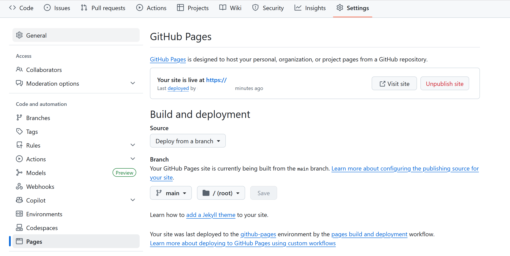

<div align="center">

# 🚀 前端部署

</div>

## 1. 部署平台選擇
您可以選擇以下平台來部署您的遊戲：

### 靜態網站托管平台：
- GitHub Pages
- Netlify
- Vercel
- AWS S3 + CloudFront

### 雲端服務：
- Heroku
- Google Cloud Platform
- Azure Static Web Apps

## 2. 部署步驟
### 使用 GitHub Pages：
1. 創建一個新的 GitHub 存儲庫
2. 將 `index.html` 文件（遊戲檔案）上傳到存儲庫
   ```markdown
   > [!IMPORTANT]
   > 請記得命名不能為其他的名稱，只能叫做 `index.html`
   ```
   
4. 進入 `Settings`，點選 `Pages`
5. 選擇主分支作為來源，通常來說在 Brench 那邊是選擇 `main`，以及 `/(root)`
6. 訪問生成的 URL（如果沒有跳出來，可以刷新頁面，會出現在 Page 頁面的最上方）

